# (C# 코딩) 계산기
## 개요
- C# 프로그래밍 학습
- 핵심기능:
1. 사용자가 입력한 숫자와 연산자를 계산하는 기능
2. 계산 결과를 화면에 표시하고 기록하는 기능
3. C, CE, Del 버튼으로 입력 초기화 및 삭제 기능
4. 제곱, 루트, Modulo 기능 추가
5. +/- 전환으로 양수, 음수 전환 기능
6. 괄호를 이용한 복잡한 사칙연산 기능
7. 계산 불가능한 경우(예: 0으로 나누기)에 대한 예외 처리 및 오류 메시지 표시 기능

- 화면구성: 숫자 버튼, 연산자 버튼, 삭제 버튼, 계산창 및 결과창, 계산기록창
## 실행 화면 (과제1)
- 1단계 코드의 실행 스크린샷

- 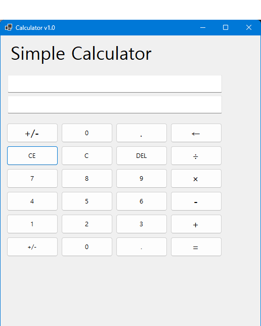
- 
초기화면

- 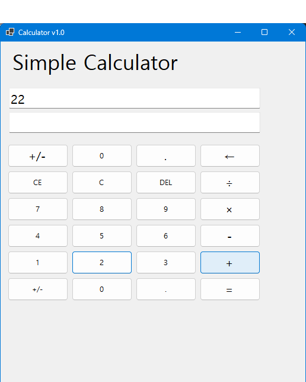
- 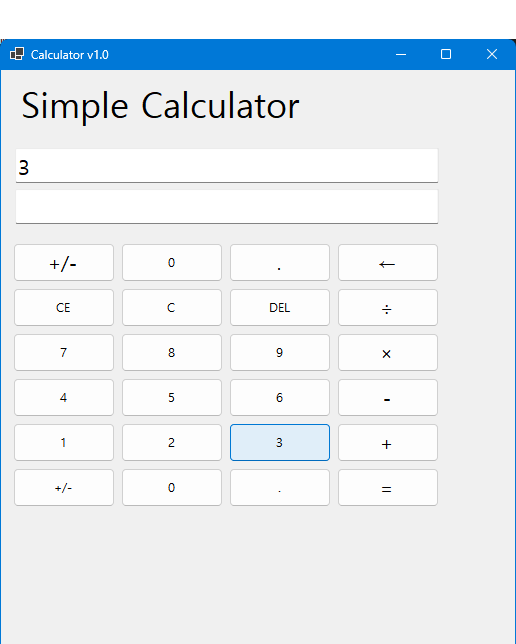
- 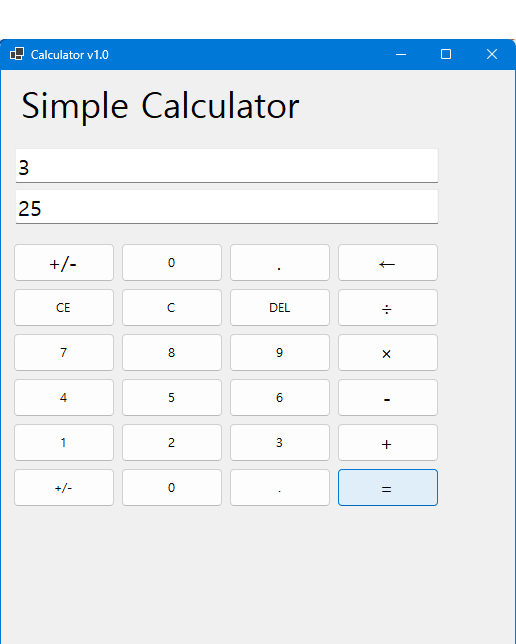
- 
숫자 (연산자) 숫자 이후 = 버튼을 누르면 계산기 작동

## 실행 화면 (과제2)
- 2단계 코드의 실행 스크린샷

- 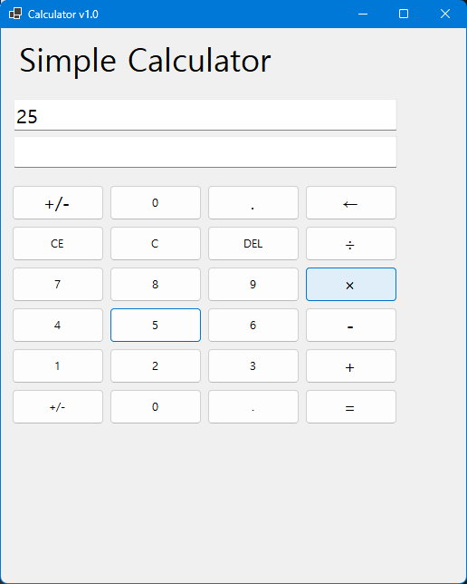
- 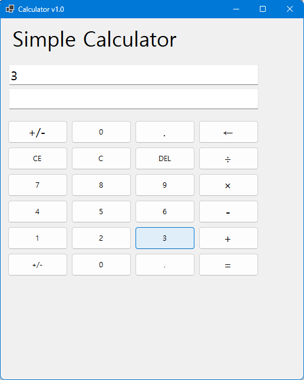
- 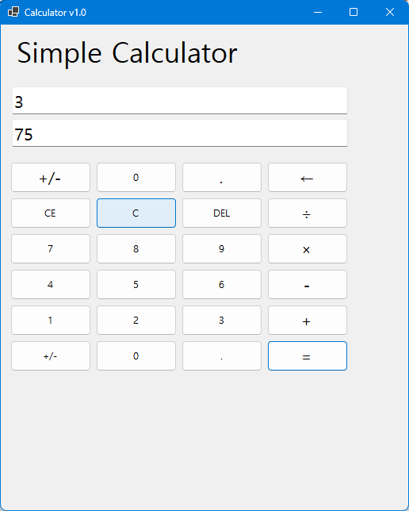
- 
곱하기와 같은 사칙 연산 기능 추가

- 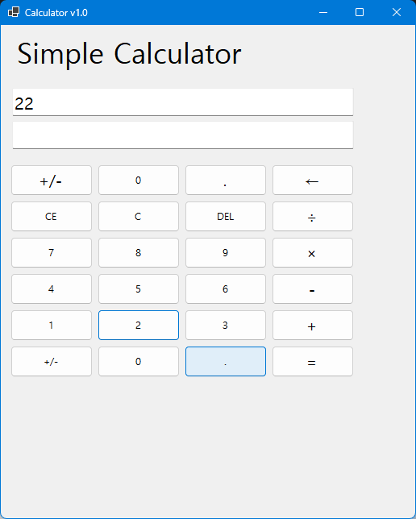
- 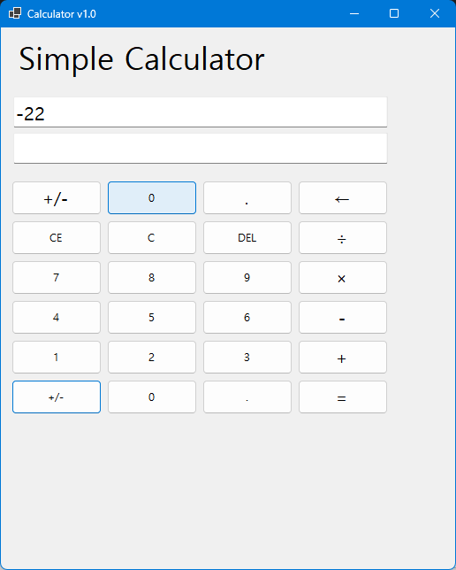
- 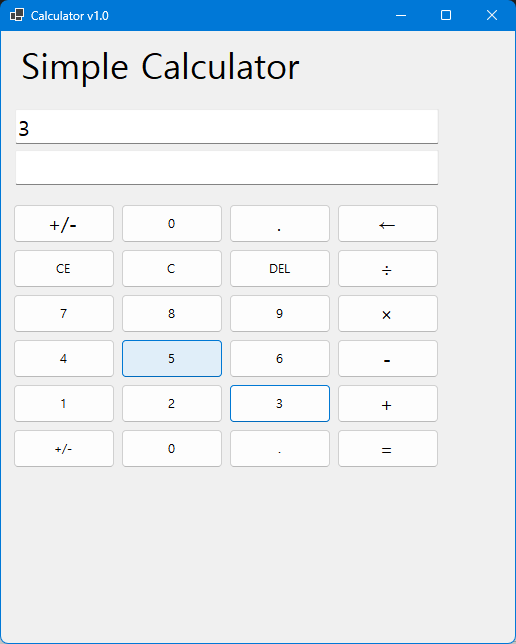
- 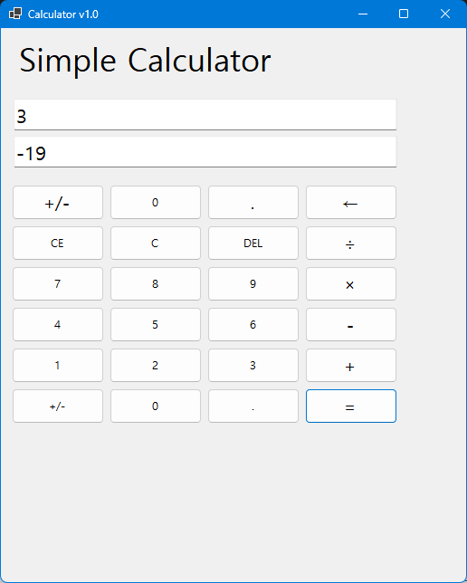
- 
+/- 버튼을 이용하여 양수, 음수 전환 가능

## 실행 화면 (과제3)
- 3단계 코드의 실행 스크린샷

- 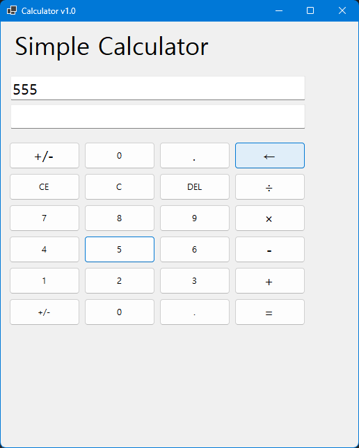
- 
- 
지우기 버튼으로 문자열 1개씩 삭제 가능

- 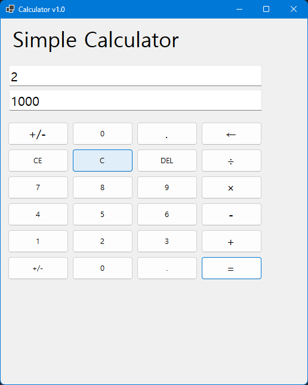
- 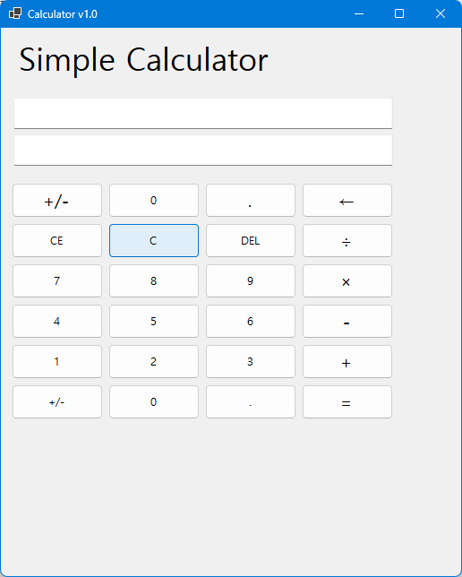
- 
초기화 버튼으로 계산 과정 및 결과 초기화 가능

- 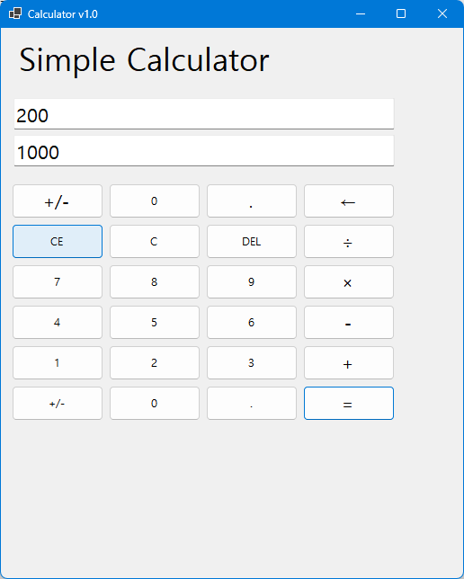
- 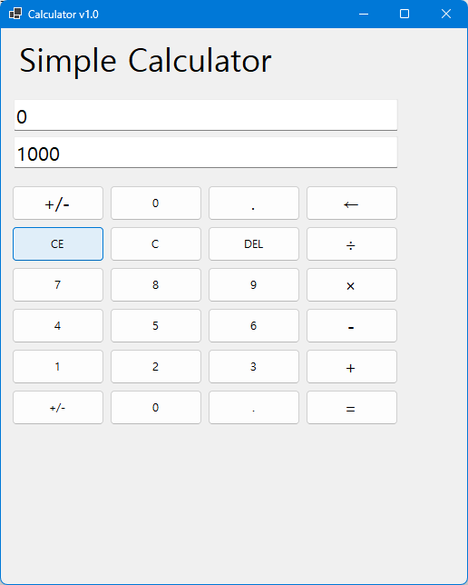
- 
CE 버튼으로 피연산자 전체 삭제 가능

## 실행	화면 (과제4)
- 4단계 코드의 실행 스크린샷

- 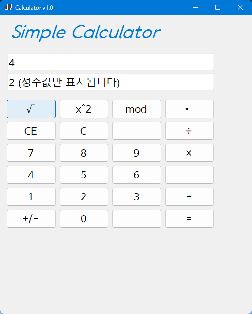
- 
루트(제곱근) 계산 기능 추가

- 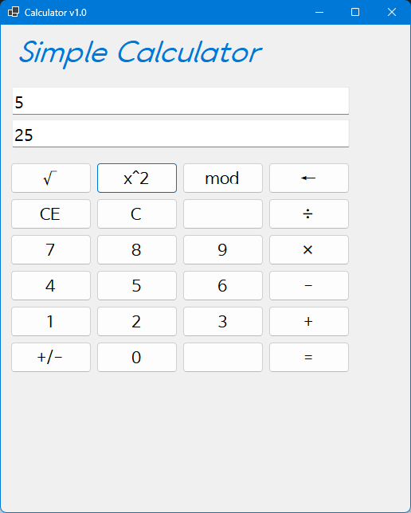
- 
제곱수 구하는 기능 추가

- 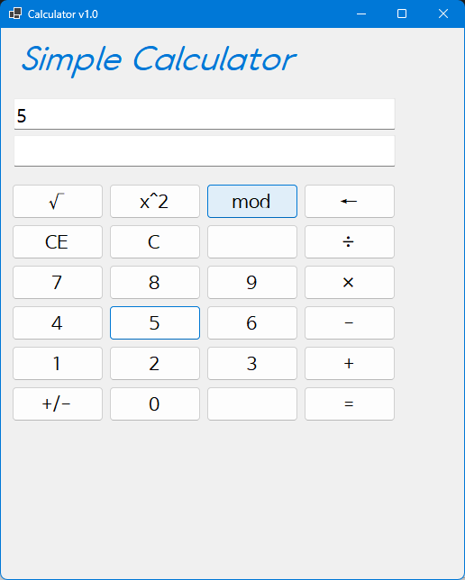
- 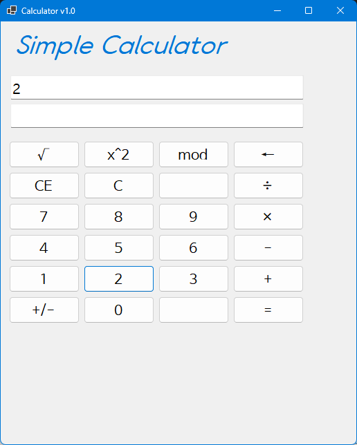
- 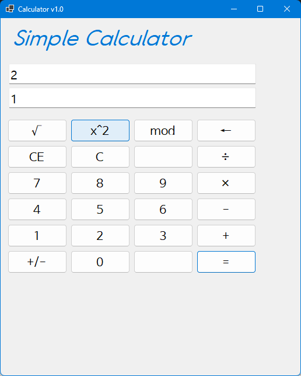
- 
mod 버튼 이용하여 나눈 값의 나머지 계산 가능

- 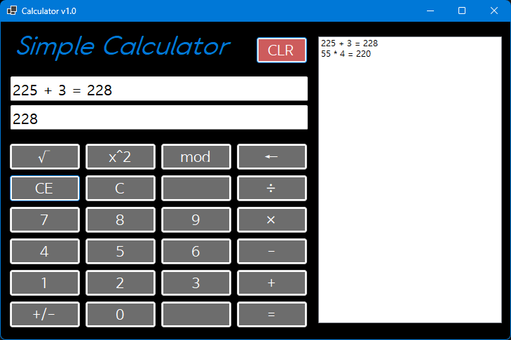
- 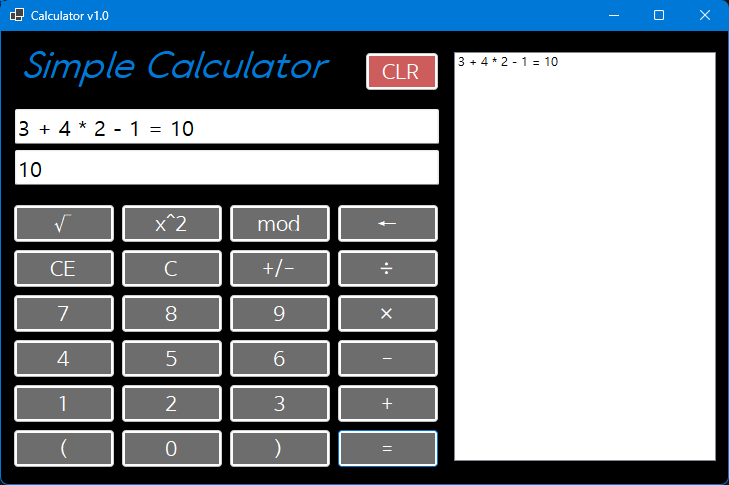
- 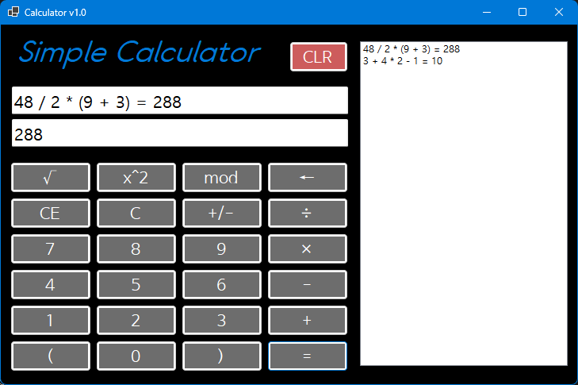
-
괄호를 이용한 사칙연산 가능

- 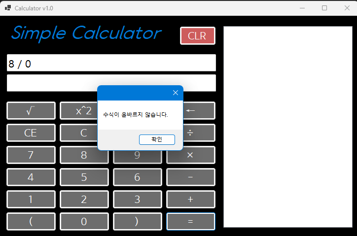

- 0으로 나누기 시 예외 처리 및 오류 메시지 표시 기능 추가

## 배운 내용
-UI 구성 요소 (버튼, 텍스트 박스 등) 사용법
-UX 개선을 위해 버튼 클릭 외에 키보드 입력으로도 계산 가능하도록 구현하는 법
-사칙연산, 제곱, 루트, Modulo 등의 수학적 연산 구현 방법
-C, CE, Del 버튼을 이용한 입력 초기화 및 삭제 기능 구현 방법
-계산 기록을 저장하고 표시하는 방법
-예외 처리 및 오류 메시지 표시 방법
